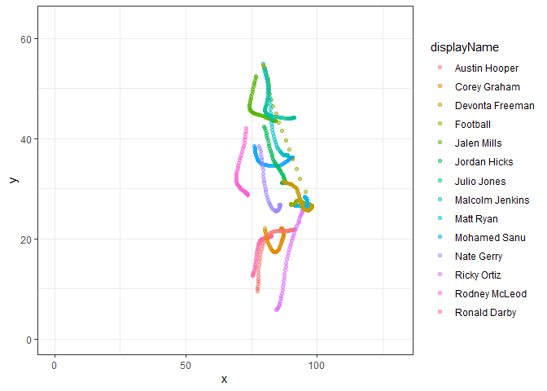
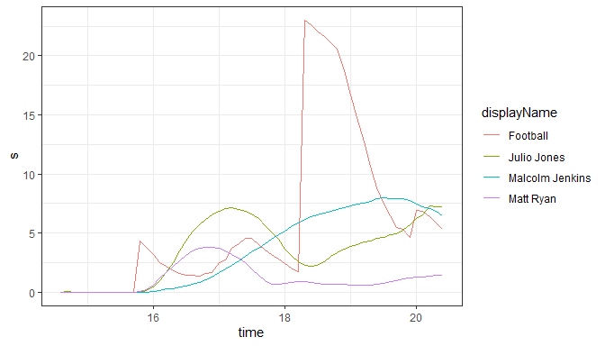
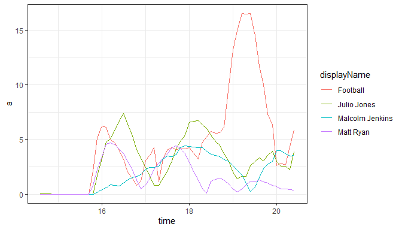
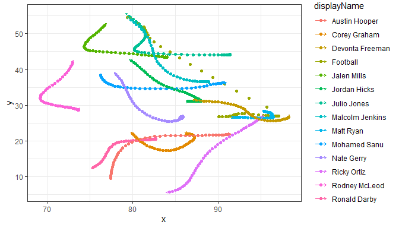

Working Kaggle Notebook
================
Roy Emanuel

Initial Data Plots of the field during a play
=============================================

The first step I took was to look at the tracking data to see if I could plot it. This was pretty straightforward.

Plot of the first play available.

Let's look at the players involved with the football: football, Matt Ryan, Julio Jones and Malcolm Jenkins.

NExt, I'm going to plot a vector for each point showing where the player is moving and how fast relatively.

The above plot doesn't really show much. Of course their direction aligns with their next point in space. That doesn't do much. So let's look where everyone is facing.

The arrow vector shows the direction the player was facing during at each time step.

